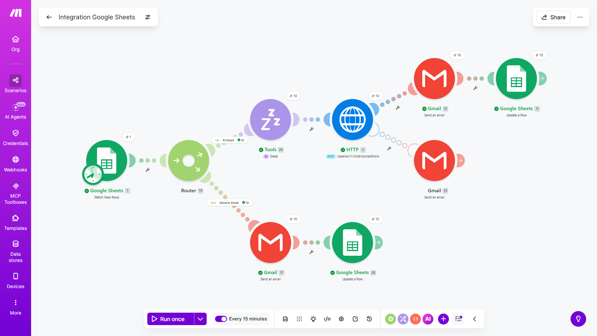
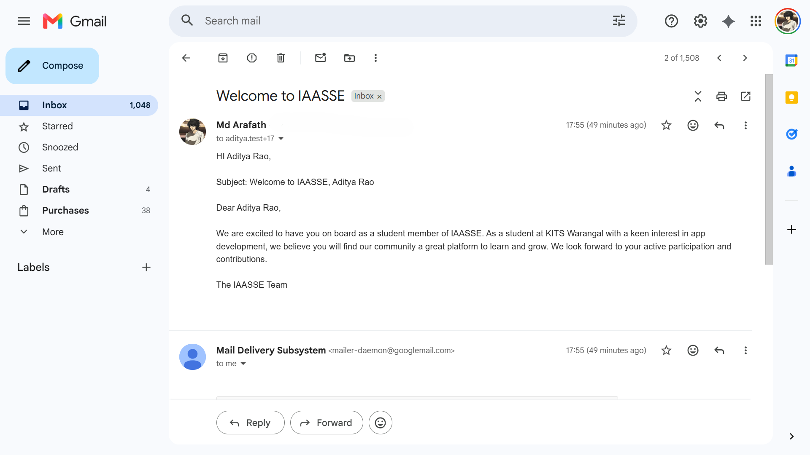
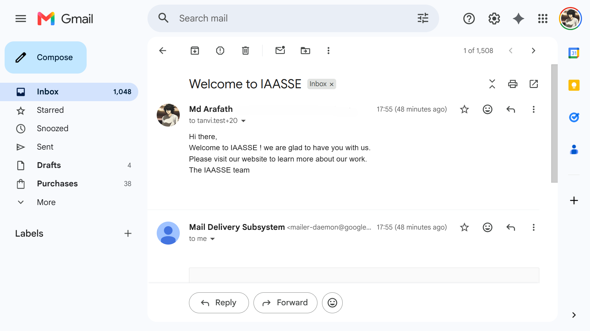
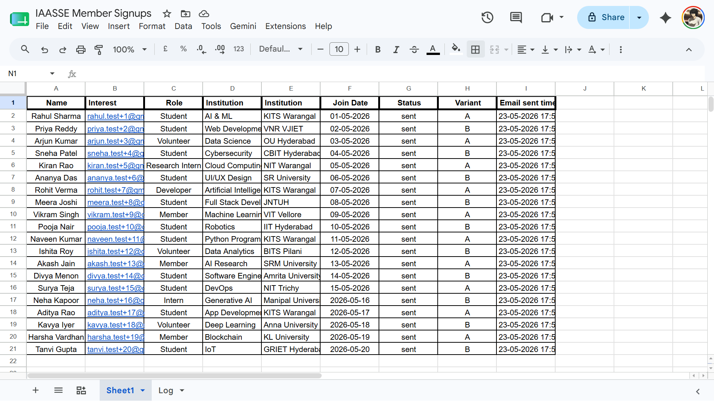

# IAASSE AI Outreach Automation System

An AI-powered automated outreach system built using Make.com, Google Sheets, Groq AI API, and Gmail for personalized member communication and workflow automation.

## Project Overview

This project automates the process of sending personalized follow-up emails to new IAASSE member signups. The system detects new entries from Google Sheets, generates AI-personalized outreach messages, sends emails automatically using Gmail, and updates tracking information such as status and timestamps.

## Features

* Automated new signup detection
* AI-personalized email generation
* Gmail integration for automated outreach
* Status and timestamp tracking
* Error handling and fallback email routing
* A/B testing support for engagement comparison
* Workflow automation using Make.com

## Technologies Used

* Make.com
* Google Sheets
* Groq AI API
* Gmail

## Workflow Architecture

Google Sheets → Make.com → AI Personalization → Gmail → Status & Timestamp Update

## Testing

The system was tested using 20 mock signup entries to verify:

* Successful email delivery
* AI personalization
* Generic fallback handling
* Status updates
* Timestamp accuracy
* Multi-row workflow execution

## A/B Testing

Two outreach variants were tested:

* Generic email outreach
* AI-personalized outreach

Results showed improved engagement potential with AI-personalized communication compared to generic templates.

## Challenges Faced

One major challenge was handling failures in AI-generated responses while ensuring reliable email delivery. This was solved by implementing router-based fallback logic and automated status tracking inside Make.com.

## Future Improvements

* Open-rate analytics dashboard
* Automated follow-up emails
* Multi-template support
* Admin monitoring dashboard
* CRM integration

## Author

Arafath
KITS Warangal

## Screenshots

### Make.com Workflow

### AI Personalized Gmail Output

### Generic Gmail Output

### Testing Results

